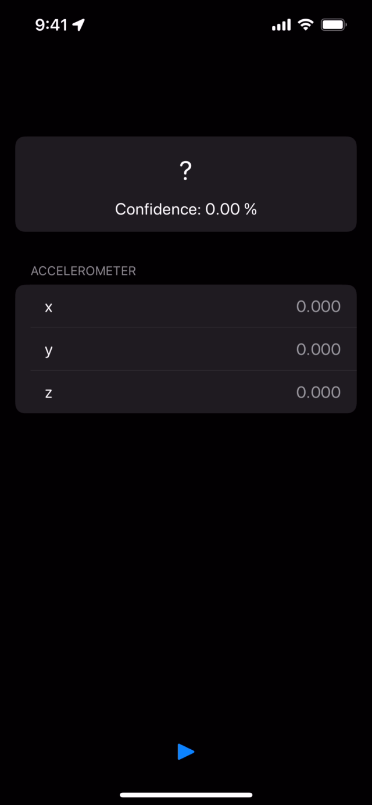

# Motion+Core ML

This is a demo app that classify activity from acceleration data obtained by iPhone with Core ML.

    

## Requirements

- iOS 14.0+
- Xcode 13.0+

## App size

Total app size: 2.2 MB

- 1.6 MB: PyramidNet18.mlmodel
- 0.6 MB: other codes
